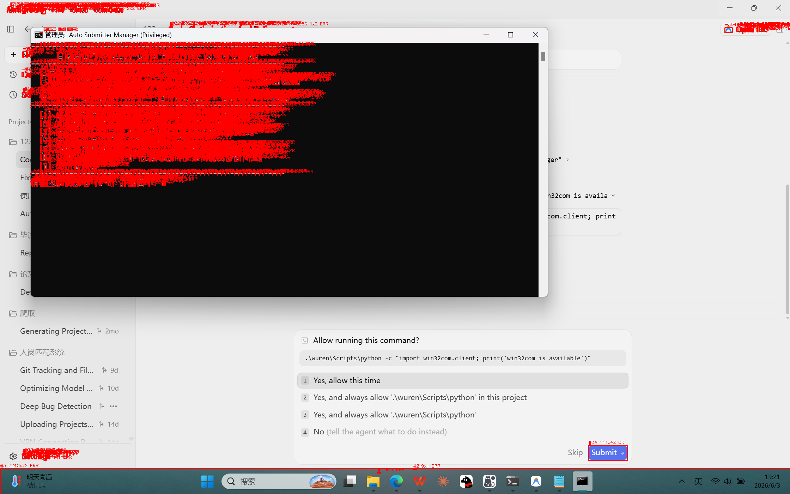

# 🛠️ 反重力 Submit & Retry 智能小助手 (Antigravity Auto Submitter)

> **基于纯计算机视觉与 Win32 底层投递技术的 AI 自动编程挂机免看管终极保障工具。**

---

## 🎯 核心解决痛点

在使用**反重力 (Antigravity)**、**VS Code**、**Cursor** 或 **Windsurf** 等编辑器进行 AI 自动编程时，由于执行命令或报错，屏幕上经常会弹出：
- **`Allow running this command?` (右下角亮蓝色 Submit 确认弹窗)**
- **`Agent terminated due to error` (右下角亮蓝色 Retry 报错重试弹窗)**

这些弹窗必须由人工点击确认或按下回车，否则 AI 进程就会一直卡死挂起。
本小助手通过**物理像素 1:1 的 OpenCV 计算机视觉检测**，实时捕捉这些亮蓝色按钮，并使用 **Win32 消息队列后台直接投递 + 物理 Enter 保底** 的双层保障方案，帮您秒消弹窗，实现 100% 脱手免看管的丝滑挂机自动编程！

---

## ✨ 核心亮点与技术特性

1. **🍀 纯计算机视觉自适应检测 (0% 配置)**
   - 不再使用死板的图片模板匹配！采用 OpenCV 轮廓匹配算法检测亮蓝色矩形块，自动适应各种高分屏（如 2K、4K）以及不同的 DPI 屏幕缩放比例（125%、150% 等），开箱即用。
2. **🔒 物理像素 1:1 对齐 + 跨进程穿透**
   - 在启动时调用 Windows DPI 适配声明，确保截图坐标与点击坐标物理级 1:1 精确落子。
   - 自动检测管理员运行特权，通过 Windows C 语言级别的 `EnumWindows` 原生 API 获取开发窗口坐标，解决权限隔离问题。
3. **🚀 三层保障确认机制 (不抢鼠标，0 误触)**
   - **第一层**：Win32 底层 `PostMessage` 后台直接投递模拟鼠标点击，物理鼠标指针**完全不动**、不抖动。
   - **第二层**：Win32 后台直接投递模拟 `Enter` 键盘回车按键。
   - **第三层 (物理保底)**：若按钮仍存在，触发 DPI 物理降级，瞬间将物理鼠标移至按钮中心点击并发送物理回车，然后极速闪回原位置。
4. **🛡️ 智能白名单过滤与安全保底**
   - 自动匹配 VS Code、Cursor、Windsurf、反重力等开发窗口的几何面积。只有在开发窗口范围内的蓝色按钮才会被点击，100% 杜绝浏览器、微信等第三方界面的蓝色误触。
   - **保底机制**：若系统会话隔离导致无法获取开发窗口标题（白名单数为 0），自动启用兜底直接确认，保证程序可用性。
5. **⌨️ 无干扰快捷暂停机制**
   - 注册非拦截式全局快捷键。日常打字、写代码打 `+` 号不受影响，但在需要暂停自动监控时，只需**按一下键盘上的 `+` 键**即可随时挂起/恢复小助手。
6. **📊 一键智能截图诊断报告**
   - 提供专属的“一键诊断”选项。当发生无法识别的情况时，可在主菜单一键生成桌面报告，自动用红绿框标出屏幕上所有检测到的蓝色块及过滤参数，快速排查故障。

---

## 🖼️ 诊断分析截图示例

当您生成诊断报告后，小助手会将屏幕上所有的蓝色块以及匹配结果输出到桌面。绿色代表通过几何校验并点击，红色代表过滤掉的非目标色块：



---

## 💻 菜单功能说明

双击运行桌面的批处理后，将直接启动 Python 驱动的交互式命令行菜单：

```text
============================================================
      自动点击与重试工具 (Auto Submitter 反重力专属版)
============================================================
  [1] 立即启动后台监控服务 (完全静默 / 无黑窗后台运行)
  [2] 立即停止后台监控服务 (关闭正在运行的后台服务)
  [3] 开启开机自动启动 (每次开机后自动在后台挂起监控)
  [4] 关闭开机自动启动 (移除开机自启配置)
  [5] 运行前台测试模式 (当前窗口直接运行并显示检测日志)
  [6] 生成一键诊断报告 (当无法识别时在桌面输出分析图文)
  [7] 退出管理器
============================================================
```

- **[1] 后台静默监控**：将开启一个完全没有黑窗口的后台常驻进程，静默保护您的自动编程。
- **[5] 前台测试模式**：在当前控制台中直接运行，能实时看到 `[定位] 已定位到目标按钮` 等日志输出。可随时按 `Ctrl + C` 退出测试返回主菜单。
- **[6] 生成一键诊断报告**：瞬间在您的桌面上生成 `submitter_diagnose_report.txt` 分析文本和 `submitter_diagnose.png` 图像，帮您看清识别情况。

---

## 📦 安装与部署

1. **环境要求**：
   - 操作系统：Windows (10/11)
   - Python 版本：3.8 或以上 (请确保将 Python 添加到了系统环境变量)
2. **快捷部署**：
   - 将项目的所有文件下载或克隆至本地。
   - 双击运行 **`自动提交一键配置助手.bat`** 即可，脚本在初次运行时会自动检查并静默为您补全 `pyautogui`, `opencv-python`, `keyboard`, `pillow` 等全部依赖库。

---

## 📝 贡献与排查

- 如果在运行中遇到按钮“识别到了但未点击”或者“完全不识别”，请在屏幕上有弹窗时，在菜单里输入 `6` 生成一键诊断数据，并将桌面上的 `submitter_diagnose_report.txt` 内容提报 Issue 进行排查。
- 欢迎提交 PR 优化 HSV 蓝色通道阈值与几何尺寸比判定！
